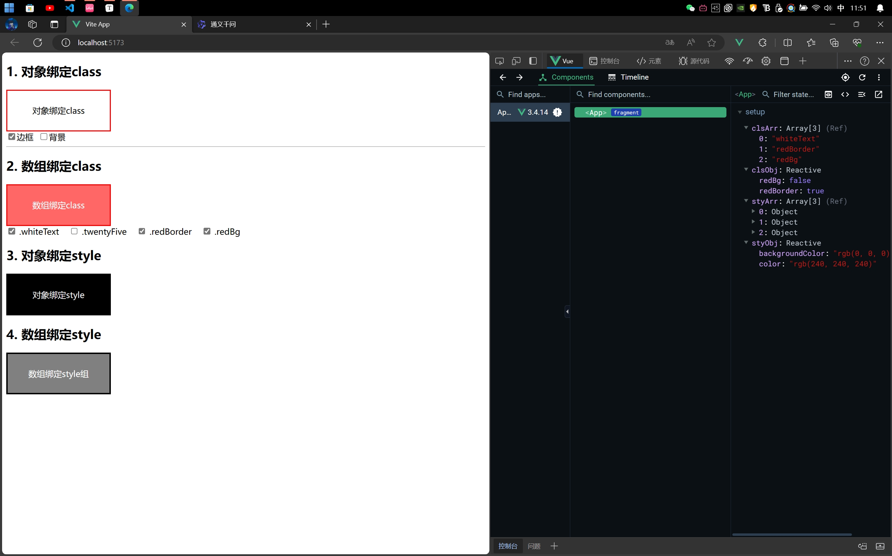
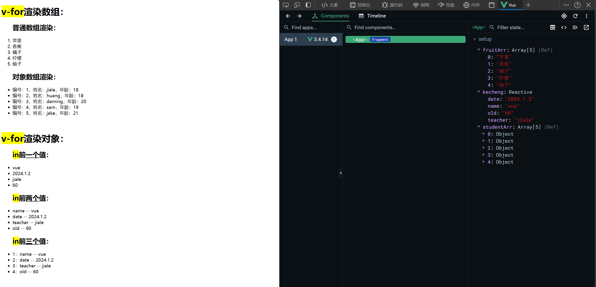

[TOC]

## 02：模板语法

> vue使用一种基于HTML的模板语法，使我们能够声明式的将其组件实例的数据绑定到呈现的DOM上。


### 2.1：内容渲染指令


#### 2.1.1：v-text

> 使用**v-text**指令，将数据采用纯文本的方式填充到<font color=red>空元素</font>内。
>
> 如果文本中有标签，还是按照纯文本方式呈现


#### 2.1.2：v-html

> 使用**v-html**指令，将数据采用HTML语法填充到<font color=red>空元素</font>内。


#### 2.1.3：文本插值 {{ }}

> 在元素中的某一位置采用<u>纯文本</u>的方式渲染数据


#### 2.1.4：代码演示

```vue
<script setup>
	import { ref, reactive } from 'vue'
    let name = ref('jiale');
    const student = reactive({
      xuehao : '22145611',
        desc : '<mark>描述</mark>'
    });
</script>
<template>
	<h2>
        <!-- 采用文本插值（{{}}）方式渲染纯文本数据 -->
        姓名：{{ name }}
    </h2>
	<div>
        <!-- 用v-text渲染数据 -->
        学号：<span v-text='student.xuehao'></span>
    </div>
	<div>
        <!-- 用v-html，结果内容中的标签会按照html语法渲染 -->
        描述：<span v-html='student.desc'></span>
    </div>
</template>
```


### 2.2：双向绑定指令


#### 2.2.1：v-model

> **`v-model`**双向数据绑定指令，数据和视图同步
>
> 一般情况下，**`v-model`**指令用到表单元素中：
>
> 1. 文本类型的`<input>`与`<textarea>`元素会绑定`value`属性，并监听`input`事件。
> 2. `<input type='checkbox'>`和`<input type=radio>`会绑定`checked`属性并监听`change`事件。
> 3. `<select>`会绑定`value`属性并监听`change`事件。
> 4. 有多选项时，数据源用数组表示。即给视图绑定的数据源为数组


**代码演示：**

```vue
<!-- v-model -->
<script setup>
  import {ref, reactive} from 'vue';
  const form = reactive({
    oneText : '单行文本框的数据', // 单行文本框
    complex : '以下几个要点需要注意......', //多行文本框数据
    open : true,  //开关灯（复选框）
    zdy : '不确定', //自定义（开关灯（复选框））
    xingqu : [
      '足球',
      '乒乓球'
    ],  //兴趣
    sex : '女', //性别
    zhengshu : 'S',  //证书等级
    citys :  [
      '临沂',
      '赤峰'
    ] //城市
  });
</script>
<template>
  <form action="javascript:void(0);">
    <!-- 单行文本框 -->
    <input type="text" v-model="form.oneText" >
    <br>
    <!-- 多行文本框 -->
    <textarea v-model="form.complex"></textarea>
    <br>
    <!-- 复选框（开关灯） -->
    <input type="checkbox" v-model="form.open" >开/关
    <br>
    <!-- 自定义复选框 -->
    <input type="checkbox" false-value="不确定" true-value="确定" v-model="form.zdy">
    <br>
    <!-- 兴趣爱好 -->
    <input type="checkbox" value="足球" v-model="form.xingqu">足球&nbsp;
    <input type="checkbox" value="篮球" v-model="form.xingqu">篮球&nbsp;
    <input type="checkbox" value="羽毛球" v-model="form.xingqu">羽毛球&nbsp;
    <input type="checkbox" value="乒乓球" v-model="form.xingqu">乒乓球&nbsp;
    <input type="checkbox" value="台球" v-model="form.xingqu">台球&nbsp;
    <br>
    <!-- 性别 -->
    <input type="radio" value="男" v-model="form.sex">男&nbsp;
    <input type="radio" value="女" v-model="form.sex">女
    <br>
    <!-- 下拉菜单 -->
    <select v-model="form.zhengshu">
      <option>A</option>
      <option>B</option>
      <option>C</option>
      <option>S</option>
    </select>
    <br>
    <!-- 城市 -->
    <select multiple v-model="form.citys">
      <optgroup label="山东">
        <option value="临沂">临沂</option>
        <option value="聊城">聊城</option>
        <option value="菏泽">菏泽</option>
        <option value="烟台">烟台</option>
      </optgroup>
      <optgroup label="内蒙古">
        <option value="赤峰">赤峰</option>
        <option value="松山">松山</option>
      </optgroup>
    </select>
  </form>
</template>
<style></style>
```


#### 2.2.2：v-model修饰符

> | **修饰符** | **作用**                                                     | **示例**                                                     |
> | ---------- | ------------------------------------------------------------ | ------------------------------------------------------------ |
> | .number    | 在同步数据的时候，vue会自动将原本number类型的数据转换为string，使用该修饰符自动将用户的输入值转为数值类型。 | \<input type='text' v-model<font color=red>.number</font>='num' > |
> | .trim      | 这个修饰符会将用户输入的数据去掉两边的空格                   | \<input type='text' v-model<font color=red>.trim</font>='str' > |
> | .lazy      | 在'input'时而非'change'时更新并同步数据                      | \<input type=text v-model.lazy='str'>                        |


### 2.3：属性绑定指令


#### 2.3.1 `v-bind` 或 `:`

> 响应式的绑定一个属性，应该使用`v-bind`指令。
>
> 如果绑定的值是`null`或者`undefined`，则该属性会直接从渲染的元素上移除。
>
> 因为`v-bind`非常常用，我们提供了特定的简写语法**`:`**

**代码演示：**

```vue
<script setup>
	import { ref } from 'vue';
    let width = 100;
    let src = 'https://pic.vjshi.com/2019-08-30/79e42f070935b4f5e018e836effa538a/00001.jpg?x-oss-process=style/watermark';
</script>
<template>
	
</template>
```


#### 2.3.2：动态绑定多个属性

> 利用对象直接为元素绑定多个属性及值。
>
> **\<input v-bind="对象名">**


#### 2.3.3：绑定`class`和`style`属性

> `class`和`style`可以和其他属性一样使用`v-bind`将他们和动态的字符串绑定；
>
> 除了可以给`style`、`class`绑定对象之外，还可以绑定数组


#### 2.3.4：代码演示

```vue
<script setup>
  import {ref, reactive} from 'vue';
  /**
   * 1. 对象绑定class
   * 2. 数组绑定class
   * 3. 对象绑定style
   * 4. 数组绑定style
   */
  // 1. class
  const clsObj = reactive({
    redBorder : true,
    redBg : false
  });
  const clsArr = ref([
    'whiteText',
    'redBorder',
    'redBg',
  ]);
  // 2. style
  const styObj = reactive({
    backgroundColor : 'rgb(0, 0, 0)',
    color : 'rgb(240, 240, 240)'
  });
  const styArr = ref([
    {
      backgroundColor : 'gray',
      color : 'white'
    },
    {
      border : 'solid 3px black'
    },
    {
      boxSizing : 'border-box'
    }
  ]);
</script>
<template>
  <h2>1. 对象绑定class</h2>
  <div v-bind:class="clsObj">对象绑定class</div>
  <input type="checkbox" v-model="clsObj.redBorder">边框&nbsp;&nbsp;<input type="checkbox" v-model="clsObj.redBg">背景 
  <hr>
  <h2>2. 数组绑定class</h2>
  <div v-bind:class="clsArr">数组绑定class</div>
  <input type="checkbox" value="whiteText" v-model="clsArr"> .whiteText
  &nbsp;&nbsp;
  <input type="checkbox" value="twentyFive" v-model="clsArr"> .twentyFive
  &nbsp;&nbsp;
  <input type="checkbox" value="redBorder" v-model="clsArr"> .redBorder
  &nbsp;&nbsp;
  <input type="checkbox" value="redBg" v-model="clsArr"> .redBg
  <h2>3. 对象绑定style</h2>
  <div v-bind:style="styObj">对象绑定style</div>
  <h2>4. 数组绑定style</h2>
  <div v-bind:style="styArr">数组绑定style组</div>
</template>
<style>
  div:not(#app) {
    width: 200px;
    height: 80px;
    display: flex;
    justify-content: center;
    align-items: center;
    box-sizing: border-box;
  }

  .redBorder {
    border: solid 2px red;
  }

  .redBg {
    background-color: rgb(255, 102, 102); 
  }

  .whiteText {
    color: white;
  }

  .twentyFive {
    font-size: 25px;
  }
</style>
```


**效果：**




### 2.4：条件渲染指令


#### 2.4.1：`v-if`、`v-else-if`、`v-else`

> 1. `v-if`指令用于条件性的渲染元素，元素只会在指令的表达式为真时才会渲染。
> 2. `v-else-if`提供的是相应于`v-if`的`else if`区块，他可以连续多次重复使用
> 3. 你也可以使用`v-else`为`v-if`添加一个`else`区块。
> 4. `v-else`与`v-else-if`必须配合`v-if`指令一起使用，否则不会被识别，而且语句块中间不能出现其他无关元素。
> 5. `v-if`支持在`<template>`元素上使用，这只是一个不可见的包装器元素，最后渲染的结果不会包含这个`<template>`元素

**代码演示：**

```vue
<script>
export default {
  data : ()=>({
    isShow : false,
    student : {
      week: 1,
      age: 20
    }
  })
}
</script>
<template>
  是否显示input<input type="checkbox" v-model="isShow">
  <!-- 
    v-if指令表达式为true时才会渲染元素
    为true时会创建该元素，为false时会销毁该元素
  -->
  <h3 v-if="isShow">这是一个普通的标题标签</h3>  
  <hr>
  年龄：&nbsp;<input type="range" min="0" max="100" v-model="student.age">{{ student.age }}
  <h1 v-if="student.age < 18">未成年</h1>
  <h2 v-else-if="student.age < 50">壮年</h2>
  <h3 v-else-if="student.age < 80">老年</h3>
  <h4 v-else>死人</h4>
  <hr>
  周{{student.week}}：<input type="range" min="1" max="7" v-model="student.week">
  <template v-if="student.week == 6 || student.week == 4 || student.week == 2">
    <mark>可以游泳</mark>
  </template>
  <template v-else>
    <mark>不可以游泳</mark>
  </template>
</template>
```


#### 2.4.2：`v-show`

> 1. `v-show`按条件显示一个元素的指令
> 2. `v-show`会在DOM渲染中保留元素，`v-show`仅切换了该元素上名为`display`的css属性
> 3. `v-show`不支持在`<template>`元素上使用，也不能和`v-else`搭配


### 2.5：事件绑定指令


#### 2.5.1：`v-on`与`@`

> 我们可以使用`v-on`指令（简写`@`）来监听DOM事件，并在事件触发时执行相应的`javascript`代码。
>
> 用法：`v-on:click=""`或`@click=""`。


**代码演示：**

```vue
<script setup>
  import {ref, reactive} from 'vue';
  // 定义音量
  let volume = ref(5);
  // 定义增加音量函数
  const addVolume = () => {
    if(volume.value != 10) {
      volume.value++;
    }
  };
  // 定义减小音量函数
  const subVolume = () => {
    if(volume.value != 0) {
      volume.value--;
    }
  }
  // 定义设置音量函数
  const setVolume = (v) => {
    volume.value = v;
  }
</script>
<template>
  <h1>当前音量：{{ volume }}</h1>
  <!-- 利用v-on绑定事件 -->
  <button v-on:click="addVolume()">加</button>
  <button v-on:click="subVolume()">小</button>
  <hr>
  <!--利用@绑定事件-->
  <button @click="setVolume(5)">中</button>
  <button @click="setVolume(0)">最小</button>
  <button @click="setVolume(10)">最大</button>
</template>
```


#### 2.5.2：事件修饰符

> | 修饰符   | 作用                                                         |
> | -------- | ------------------------------------------------------------ |
> | .prevent | 阻止默认行为，如表单的提交事件( `submit` )、链接的跳转事件( `click` )等 |
> | .stop    | 阻止事件冒泡                                                 |
> | .once    | 用于在监听事件时，只触发一次回调函数。                       |
> | .self    | 只会在event.target是当前元素自身时触发事件处理函数           |
> | .capture | 1. 以捕获模式触发当前事件处理函数<br/>2. 当元素事件产生冒泡时，先触发的是该修饰符的元素<br/>3. 如果有多个该修饰符，会由外向内触发 |
> | .passive | 表示不想阻止事件的默认行为，不能和`.prevent`一起使用         |
>


### 2.6：按键修饰符

> **按键别名：**`.enter`、`tab`、`.esc`、`.space`、`.up`、`.down`、`.left`、`.right`、`.delete`( 捕获<kbd>delete</kbd>与<kbd>Backbase</kbd>)
>
> **系统修饰符：**`.ctrl`、`.alt`、`.shift`、`.meta`
>
> **准确的修饰符：**`.exact`

**代码演示：**

```vue
<script setup>
	
</script>
<template>
	<button @keydown.space="console.log('跳跃');">空格</button>
	<button @keydown.alt.tab="console.log('Alt Tab');">Alt+Tab</button>
	<button @keydown.ctrl.enter="console.log('Ctrl Enter');">Ctrl+Enter</button>
</template>
```


### 2.7：鼠标按键修饰符

> `.left`：点击鼠标左键
>
> `.right`：点击鼠标右键
>
> `.middle`：点击鼠标中键

**代码演示：**

```vue
<script setup>
	
</script>
<template>
	<button @click.left="console.log('左键');">左键</button>
	<button @click.middle="console.log('中键');">中键</button>
	<button @click.right="console.log('右键');">右键</button>
</template>
```


### 2.8：列表渲染指令

> 使用`v-for`指令基于一个数组或者对象渲染一个列表


#### 2.8.1：`v-for`渲染数组

1. `in`前一个参数：`item in items`

   `item：`值

   `items：`需要循环的数组

2. `in`前两个参数：`(value, index) in items`

   `value：`值

   `index：`索引

   `items：`需要循环的数组


#### 2.8.2：`v-for`渲染对象

1. `in`前一个参数：`value in object`

   `value：`属性值

   `item：`需要循环的对象

2. `in`前两个参数：`(value, key) in object`

   `value：`属性值

   `key`：键

   `items：`需要循环的对象

3. `in`前三个参数：`(value, key, index) in object`

   `value：`属性值

   `key：`键

   `index：`索引

   `items：`需要循环的对象


#### 2.8.3：代码演示：

```vue
<script setup>
	import {ref, reactive} from 'vue';
	const fruitArr = ref([
		'苹果',
		'香蕉',
		'橘子',
		'柠檬',
		'柚子'
	]);
	const studentArr = ref([
		{name:'jiale',age:18},
		{name:'huang',age:18},
		{name:'daming',age:20},
		{name:'sam',age:19},
		{name:'jake',age:21}
	]);
	const kecheng = reactive({
		name: 'vue',
		date: '2024.1.2',
		teacher: 'jiale',
		old: '60'
	});
</script>
<template>
	<h1><mark>v-for</mark>渲染数组：</h1>
	<ol>
		<h2>普通数组渲染：</h2>
		<li v-for="item in fruitArr">{{ item }}</li>
	</ol>
	<ul>
		<h2>对象数组渲染：</h2>
		<li v-for="(item, index) in studentArr">编号：{{ index+1 }}，姓名：{{ item.name }}，年龄：{{ item.age  }}</li>
	</ul>
	<br>
	<h1><mark>v-for</mark>渲染对象：</h1>
	<ul>
		<h2><mark>in</mark>前<u>一个</u>值：</h2>
		<li v-for="item in kecheng">{{ item }}</li>
	</ul>
	<ul>
		<h2><mark>in</mark>前<u>两个</u>值：</h2>
		<li v-for="(value, key) in kecheng">{{ key }} -- {{ value }}</li>
	</ul>
	<ul>
		<h2><mark>in</mark>前<u>三个</u>值：</h2>
		<li v-for="(value, key, index) in kecheng">{{index+1}}：{{ key }} -- {{ value }}</li>
	</ul>
</template>
```


**效果：**




### 2.9：`key`属性管理状态

> 当列表的数据发生变化时，默认情况下，`vue`会尽可能地‘复用’已存在的`DOM`元素，从而提升渲染的性能。
>
> `key`的作用就是给元素唯一标识，便于vue进行列表项的正确排序复用
>
> **注意：**
>
> 1. `key`的值只能是字符串或数字类型
> 2. `key`的值必须有唯一性
> 3. 推荐使用`id`作为key( 唯一 )，不推荐使用`index`作为`key`( 会变化，不对应 )


### 拓展


#### 1：表单控件的**true-value/false-value**属性

> 在Vue.js中，**`true-value`**和**`false-value`**是用于复选框（checkbox）或单选按钮（radio）的属性。它们用来指定控件在被选中（checked）时对应的值以及未选中时对应的值。

例如：

```vue
<input type='checkbox' v-model='xuan' true-value='选中' false-value='未选中'>
```

> 在这个例子中，当复选框被选中时，数据源**xuan**将会被赋值`选中`，反之则是`未选中 `
>
> 默认情况下，`true-value`的值是`true`，`false-value`的值是`false`


#### 2：`matches()`方法

> `matches()`是element的一个原生方法，它允许开发者检查当前元素是否匹配给定的选择器字符串。这个方法遵循CSS选择器规范，因此，可以用来检测元素是否满足特定的css样式规则。

```html
/** 
   语法：
	boolean element.metches(选择器字符串);
*/
<div class='a b' id=div></div>
<button id=btn>增加年龄</button>
<script>
    console.log(div.matches('.h'));    //返回：false
</script>
```


