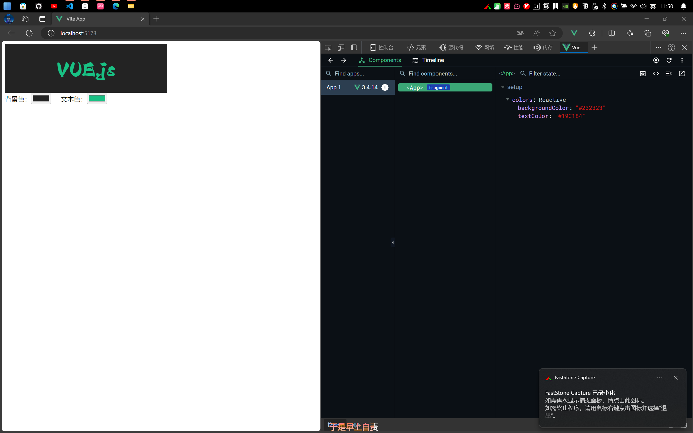
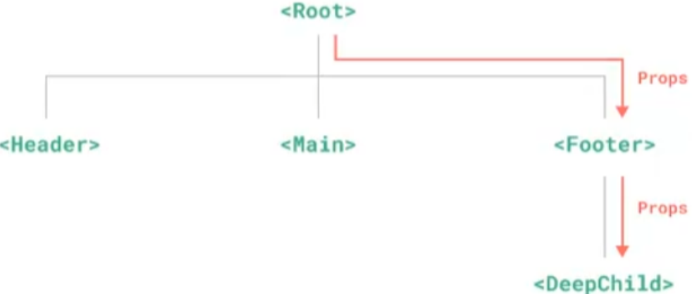
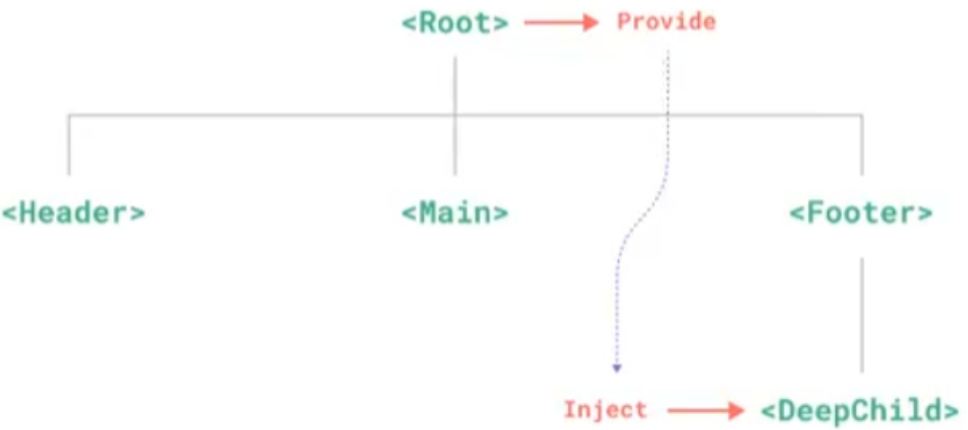
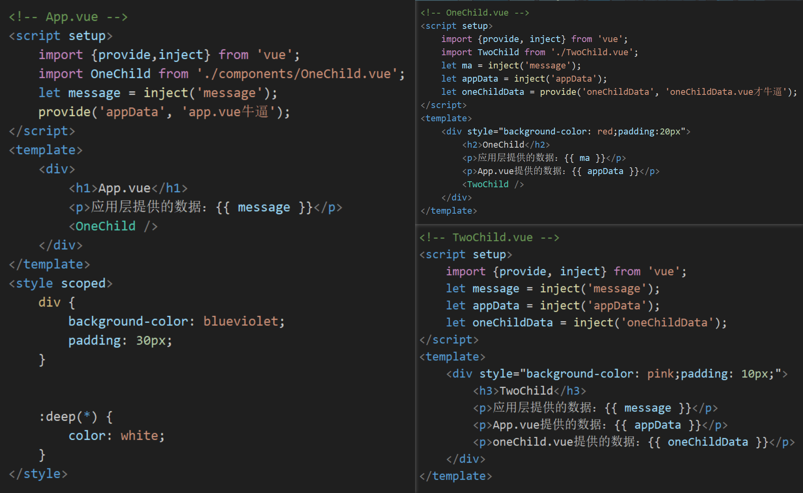
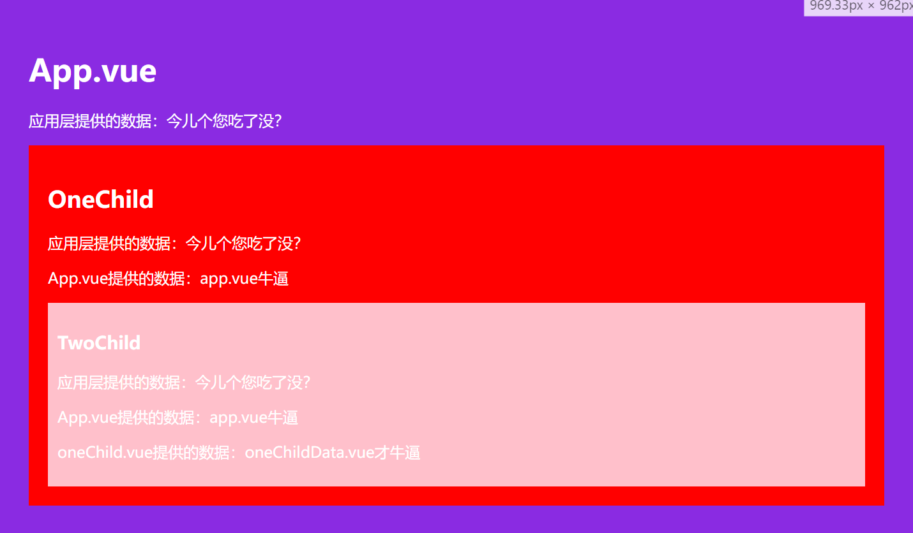
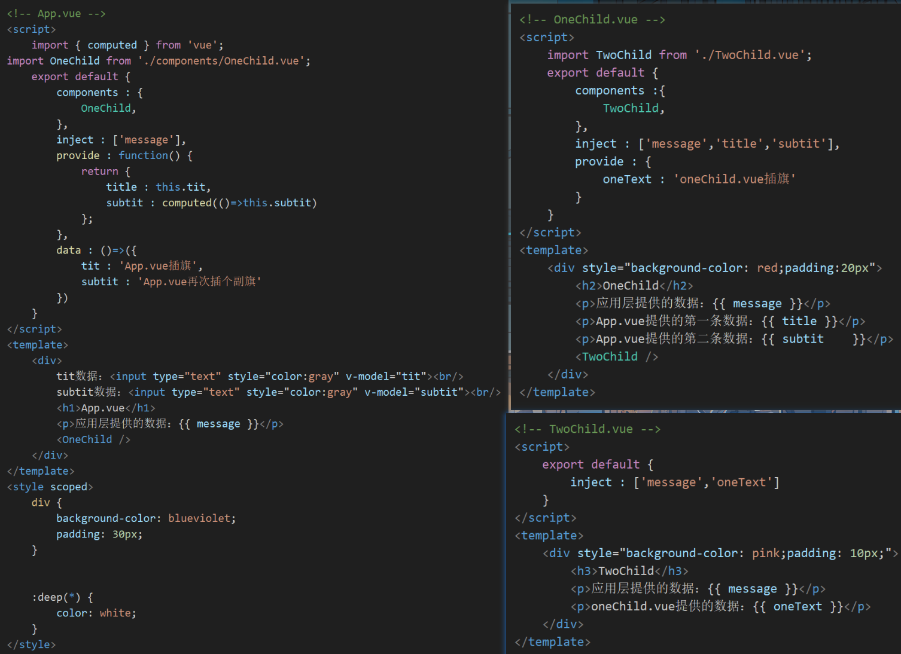
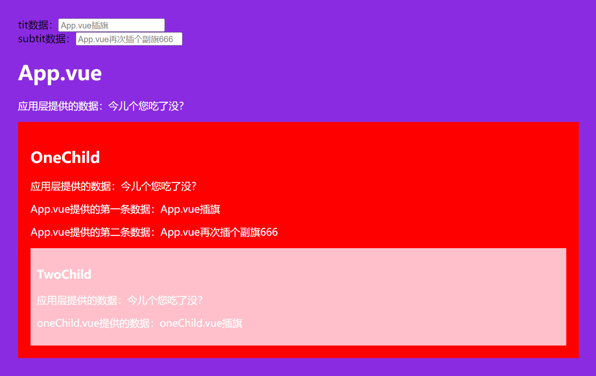
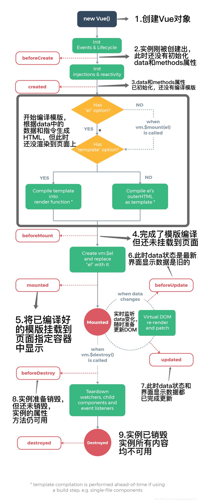

[TOC]

## 05：组件

> 在`vue3`中，组件是Vue实例的一个独立单元，具有自己的模板、脚本、样式。组件可以被视为可重用的、自包含的代码块，用于构建用户页面。


### 5.1：注册组件1   

> 一个`vue`组件在使用前需要先被“注册”，这样`vue`才能在渲染模板时找到其对应的实现；
>
> 组件注册有两种方式，`全局注册`，`局部注册`


#### 5.1.1：全局注册

> + 全局注册可以使用`app.component()`注册组件的方法，在此应用的任意组件的模板中使用
>
> + **语法：**
>
>   **app . component( `name`,  `component` )**
>
>   1. `name`：注册的名字，字符串形式
>   2. `component`：需要注册的组件
>   
> + 全局注册一般步骤如下：
>
>   1. 在`\component\`目录下创建vue组件
>   2. 在`main.js`里引入组件
>   3. 用`app.component()`函数来注册组件
>   4. 在这个应用的任意模板中使用：`<组件名称>`

**代码演示：**

```vue
<!-- 1. 创建要注册的组件  login.vue -->
<script setup>
    import {ref} from 'vue';
	let account = ref('');
</script>
<template>
	<form>
        <input type='text' placeholder='请输入账号' v-model='account'>
        <input type='submit' submit='提交' @click.prevent='voi(0)'>
    </form>
</template>
```

```javascript
// 2. 将组件引入main.js  main.js
import { createApp } from 'vue'
import App from './App.vue'
import loginVue from './components/login.vue';
let app = createApp(App);
// 3. 注册该组件
app.component('login', loginVue);
app.mount('#app')
```

```vue
<!-- 在App.vue中使用 -->
<script setup></script>
<template>
	<!-- 4. 使用该组件 -->
	<login />
</template>
```


#### 5.1.2：局部注册

> 局部注册的组件需要在他的父组件中显式导入，并且只能在该父组件中使用


##### 5.1.2.1：选项式API局部注册

> + 再选项式API中，可以在`components`选项中注册组件。
> + `components`选项中，`键`就是注册的名字，`值`就是要注册的组件。

**代码演示：**

```vue
<script>
    import login from './components/login.vue';
    export default {
        components : {
            // 可直接简写为：login,
            'login' : login
        }
    }
</script>
<template>
    <login />
</template>
```


##### 5.1.2.2：组合式API局部注册

> 组合式API局部注册极为简单，只需要在`<script setup>`中，直接导入组件就可以在模板中使用。

**代码演示：**

```vue
<script setup>
    import login from './components/login.vue';
</script>
<template>
	<login />
</template>
```


### 5.2：传递数据


#### 5.2.1：父向子传值

> + 如果父组件向子组件进行传递数据，那么我们需要在子组件中声明`props`来接收传递数据的属性，可采用`字符串数组式`或`对象式`来声明`props`。
> + 父组件向子组件传递数据，在使用组件的标签上采用属性方式传递的`props`值，可使用`v-bind:`或`:`来绑定属性。
> + 组件中`props`中的数据是只读的，不可直接更改，只能通过父组件进行更改。


##### 5.2.1.1：选项式API中传值(父向子)

> `a.` 我们可以提供`props`选项来声明接收传递的数据。
>
> `b.` 在`JS`中可以使用`this.$props`来访问声明的自定义属性。
>
> `c.` 在视图模板中，可直接访问`props`中声明的自定义属性。


**代码演示：**

```vue
<script>
    export default {
        /* 字符串数组形式
        props : ['text', 'bg', 'border']*/
        
        /* 对象形式 */
        props : {
            border : {
                default : true,
                required : true
            },
            bg : {
                default : false,
                required : true
            },
            text : {
                default : 't54j',
                validator: (value) => {
                    return value=='tj';
                }
            }
        }
    }
</script>
```


##### 5.2.1.2：组合式API中传值(父向子)

> `a.` 我们采用`defineProps`宏来声明接收传递的数据
>
> `b.` 在`JS`中可使用`defineProps`返回的对象来访问声明的自定义属性
>
> `c.` 在视图模板中，可直接访问`defineProps`中声明的自定义属性


###### 5.2.1.2.1：字符串数组的形式

> 使用`defineProps`宏来声明


**代码演示：**

```vue
<script setup>
	// 这个返回的对象是只读的，无法修改
    const datas = defineProps(['title', 'flag', 'border']);		// defineProps函数返回的是一个数据对象
</script>
<template>
	<!-- 在模板中可以直接访问 -->
	
</template>
```


###### 5.2.1.2.1：对象的形式

> + 以对象形式声明的`props`，可以对传来的值进行校验，如果传入的值不符合要求，会在浏览器控制台中抛出警告来提醒使用者。
>
> + 对象形式声明的`props`，`key`是`prop`的名称，值则为约束的条件
>
> + **对象的属性：**
>
>   `type`：类型，如`String`、`Number`、`Boolean`、`Array`、`Object`、`Date`、`Function`、`Symbol`
>
>   `default`：默认值，对象或者数组应当用工厂函数返回
>
>   `required`：是否必填，布尔值
>
>   `validator`：自定义校验，函数类型
>
>   + 校验函数中要有返回值。返回值的类型是`Boolean`。返回值的作用是判断传递给组建的`prop`是否符合预期的条件。
>   + 校验函数可以有一个形参，这个形参传入的是`prop`。表示从父组件传递给子组件的`prop`的值。


**代码演示：**

```vue
<script setup>
    const datas = defineProps({
        text : {
            type : String,
            default : '提交',
            // 如果传入的值不是"提交"，就警告
            validator : (value)=> {
                if(value != '提交') {
                    return false;
                } else {
                    return true;
                }
            }
        },
        // 如果只有一个键值对，则可以简写
        bg : {
            type : Boolean,
            default : false
        },
        border : {
            type : Boolean,
            default : true
        }
    });
</script>
```


#### 5.2.2：子向父传值

> 父组件在使用子组件时，传值一般分为三步：
>
> 1. 子组件声明自定义事件
> 2. 子组件中触发自定义事件（可传值）
> 3. 父组件使用子组件时监听对应的自定义事件，并执行父组件中的函数（获取子组件传递的值）


##### 5.2.2.1：【子组件】声明组件事件


###### 5.2.2.1.1：选项式API声明组件事件

> + 在选项式API中，子组件可通过`emits`选项来声明自定义事件
>
> + `emits`中声明事件时可以是`字符串数组`，也可以是`对象`。
>
> + 如果是`对象形式`，
>
>   每个`键`都是自定义事件名，
>
>   如果不需要验证，可以给相应的属性的值设置为`null`，需要验证则设置为一个函数，形参是传入父组件的值，这个函数根据返回值( Boolean )来判断是否抛出警告。


**代码演示：**

```vue
<!-- 子组件child.vue -->
<script>
	export default {
        // 声明自定义事件
        emits : ['changeName', 'changeAge'],
        /* 对象形式：
        	emilts : {
        		changeName : null,
        		changeAge : (value)=>{
        			if(value!=10) {
        				return false;
        			}
        			return true;
        		}
        	}
        */
    	methods : {
            // 声明一个函数，此函数内容主要是触发自定义事件
            changeName() {
                // 用 this.$emit() 函数触发自定义事件，并传值
                this.emit('changeName', '荒');
            }
        }
    }
</script>
<template>
	<button @click="changeName">改变姓名</button>
	<button @click="$emit('changeAge', 1000)">改变年龄</button>
</template>
```


###### 5.2.2.1.2：组合式API声明组件事件

> + 组合式API组件声明事件是通过`defineEmits()`宏来声明自定义事件。
>
> + `defineEmits()`返回一个`emit(event, ...args)`函数，这个函数用来触发自定义的事件
>
>   + `event`：字符串类型，事件名
>
>   + `...args`：传递参数，可以没有，也可以多个


##### 5.2.2.2：【子组件】触发组件事件


###### 5.2.2.2.1：选项式API触发组件事件

> 在选项式API中，可通过组件当前实例`this.$emit(event, ...args)`来触发当前组件自定义的事件
>
> + `event`：触发的事件名，字符串类型
> + `...args`：传递参数，可以没有，也可以多个


**代码演示：**

```vue
<script>
	export default {
        emits : [
            'changeName',
            'changeAge'
        ],
        methods : {
            // 声明一个函数，此函数内容主要是触发自定义事件
            changeName() {
                // 用 this.$emit() 函数触发自定义事件，并传值
                this.emit('changeName', '荒');
            }
        },
    }
</script>
<template>
	<button @click="changeName">改变姓名</button>
	<button @click="$emit('changeAge', 1000)">改变年龄</button>
</template>
```


###### 5.2.2.2.2：组合式API触发组件事件

> + 在组合式API中，`defineEmits()`方法会返回一个函数，调用这个函数就会触发自定义事件。
>
> + 这个函数有多个参数：
>
>   `event`：自定义事件名字，字符串类型
>
>   `...args`：传递的参数，可以没有，也可以多个


**代码演示：**

```vue
<script setup>
    let emit = defineEmits(['changeName', 'changeAge']);
    const changeName = () => {
        emit('changeName', '荒');
    }
</script>
<template>
	<button @click="changeName">改变姓名</button>
	<button @click="emit('changeAge', 1000)">改变年龄</button>
</template>
```


##### 5.2.2.3：【父组件】监听子组件自定义事件

> 使用`v-on:event='callback'`或者`@event='callback'`来监听子组件是否触发了该事件。
>
> + `event`：事件名字（ camelCase形式命名的事件，在父组件中可以使用camel-case的形式监听 ）
> + `callback`：回调函数，如果子组件触发该事件，那么父组件中执行对应的回调函数，回调函数声明参数可自动接收到触发事件传来的值


**代码演示：**

```vue
<!-- 父组件father.vue -->
<script>
    import childVue from './child.vue';
	export default {
        components : {childVue,},
        methods : {
            changeName(value){
                console.log("新名字");
                this.student.name = value;
            }
        },
        data : ()=>({
            student : {
                name : '海神',
                age : 18
            }
        })
    }
</script>
<template>
	<div>{{ student }}</div>
	<childVue @changeName="changeName" />
</template>
```


### 5.3：透传属性和事件

> Vue3中的`透传属性`和`透传事件`是用于组件复用时，将父组件传递给子组件的未知属性和事件进一步向下传递子组件内部更深层的DOM元素技术。


#### 5.3.1：如何“透传属性和事件”

> - 透传属性和事件并没有在子组件中用`props`和`emits`声明
> - 透传属性和事件最常见的如`@click`和`class`、`id`、`style`
> - 当子组件**<u>只有一个根元素</u>**时，透传属性或事件会自动添加到<font color=red>根元素</font>( 若有多个根元素则传输失败，抛出一个警告 )上。如果根元素已有`class`或`style`属性，他会自动合并


**代码演示：**

```vue
<!-- Parent.vue -->
<template>
    <ChildText style="cursor: pointer;" class="btn" @click="console.log('透传');"/>
</template>

<!-- Child.vue -->
<template>
    <button>按钮</button>
</template>
<style>
    button {
        border: none;
        padding: 8px 15px;
        background-color: rgb(100, 100, 100);
        color: white;
        border: solid 2px rgb(100, 100, 100);
        transition: all .1s linear;
        box-sizing: border-box;
    }
    
    .btn:hover {
        background-color: white;
        color: rgb(100, 100, 100);
        border: solid 2px rgb(100, 100, 100);
    }
</style>
```

*此时，页面中会出现一个有`btn`*类，并且点击时会向控制台发送一条消息的按钮。


#### 5.3.2：阻止“透传属性和事件”

> - 当子组件<u>只有一个根元素</u>时，透传属性和事件会自动添加到该根元素上
> - 阻止透传属性和事件：
>   1. 选项式API。可以在组件选项中设置`inheritAttrs: false`来阻止
>   2. 组合式API`<script setup>`中，你需要一个额外的`<script>`快来书写`inheritAttrs: false`选项。


**代码演示：**

```vue
<!-- Child.vue添加到子组件上 -->
<script>
	export default {
        inheritAttrs : false
    }
</script>
```


#### 5.3.3：多根元素的“透传属性和事件”

> 多根节点的组件并没有自动“透传属性和事件”的行为
>
> 由于vue不确定要将“透传属性和事件”透传到哪里，所以我们需要用`v-bind="$attrs"`来显示绑定，否则会抛出一个运行时警告


**代码演示：**

```vue
<template>
    <button>按钮</button>
    <button v-bind="$attrs">按钮</button>
    <button :="$attrs">按钮</button>
</template>
```


#### 5.3.4：访问“透传的属性和事件”


##### 5.3.4.1：选项式API访问

> 选项式API中，我们可以通过`this.$attrs`来访问“透传属性和事件”


**代码演示：**

```vue
<script>
	export default {
        methods : {
            getAttrs() {
                // 获取透传过来的属性和方法
                console.log(this.$attrs);
            }
        }
    }
</script>
<template>
	<button v-bind='$attrs' @click='getAttrs'>获取透传属性和方法</button>
	<ul>
        <!-- 模板视图中，可以省略this，直接写$attrs -->
        <li v-for='(value, key) in $attrs'>{{ key }} -- {{ value }}</li>
    </ul>
</template>
```


##### 5.3.4.2：组合式API访问

> 组合式API中，要引入`useAttrs()`来访问一个组件的“透传属性和事件”
>
> `useAttrs()`返回的是一个对象，对象的内容是透传过来的属性和事件


**代码演示：**

```vue
<script setup>
    import {useAttrs} from 'vue';
    let attrs = useAttrs();
    const getAttrs = () => {
        console.log(attrs);
    }
</script>
<template>
	<button v-bind='attrs' @click='getAttrs'>获取透传属性和方法</button>
	<ul>
        <!-- 模板视图中，可以省略this，直接写$attrs -->
        <li v-for='(value, key) in attrs'>{{ key }} -- {{ value }}</li>
    </ul>
</template>
```


##### 5.3.4.3：注意

> + 虽然这里的`attrs`对象总是反应最新的“透传属性和事件”，但它并不是响应式的（考虑到性能因素），你不能通过侦听器去监听它的变化
> + 如果你需要响应性，可以使用`prop`或者你也可以使用`onUpdated()`使得在每次更新时结合最新的`attrs`执行副作用


### 5.4：插槽

> - `插槽`是vue.js的一种机制，用于在组件模板中定义一些可以由父组件传递内容的位置。
> - 插槽允许你在组件内部预留一些位置，让父组件可以插入特定的内容到这些位置上。
> - 在vue.js中，插槽主要通过`<slot>`元素来定义。这个元素在模板中充当一个占位符，父组件可以在这个占位符的位置插入自己的内容。
> - **注意：如果分装组件时没有预留任何`<slot>`插槽，用户提供传递一些模板片段将会被遗弃。**


#### 5.4.1：基础插槽

> 在组件模板中使用`<slot>`元素表示插槽。
>
> 父组件可以在子组件插槽位置插入内容。


**代码演示：**

```vue
<!-- Child.vue -->
<template>
	<div>
        <!-- 插槽在此创建 -->
        <slot>默认值</slot>
    </div>
</template>

<!-- Parent.vue -->
<script setup>
	import SlotVue from 'Child.vue';
</script>
<template>
	<SlotVue>
    	<!-- 向子组件传值，传入一个button -->
        <button>关闭</button>
    </SlotVue>
</template>
```


#### 5.4.2：具名插槽

> 1. 如果在封装组件时需要预留多个插槽节点，则需要为每个`<slot>`插槽指定具体的`name`名称，这种带有具体名称的插槽叫做`具名插槽`。
> 2. 没有指定`name`名称的插槽，会有隐含的名称叫做`default`
> 3. 在`<template>`元素上使用`v-slot: slotName`或`#slotName`向指定的具名插槽提供内容。
> 4. **注意：`v-slot`只能用在`<template>`标签上。**
> 5. 具名插槽允许定义多个插槽，每个插槽有一个唯一的名称。


**代码演示：**

```vue
<!-- Child.vue -->
<template>
	<div class='div01'>
        <slot name='openBtn'></slot>
    </div>
	<div class='div02'>
        <slot name='closeBtn'></slot>
    </div>
</template>

<!-- Parent.vue -->
<script setup>
	import ChildVue from 'Child.vue';
</script>
<template>
	<ChildVue>
    	<template v-slot:openBtn>
			<button>open</button>
		</template>
		<template v-slot:closeBtn>
			<button>close</button>
		</template>
    </ChildVue>
</template>
```


#### 5.4.3：作用域插槽

> 父组件在向插槽提供内容时获得子组件域内的数据：
>
> 1. 在声明插槽时使用属性值的方式来传递子组件的数据，这种有数据的插槽称之为`作用域插槽`
> 2. 在`<template>`元素上使用`v-slot: slotName=“slotProps”`或`#slotName="slotProps"`的方式来访问插槽传递的属性值。
> 3. 如果没有使用`<template>`元素，而是直接在子组件中直接给默认插槽提供内容，我们可以使用该子组件时用`v-slot:slotProps`来接收该插槽传递的数据对象。


**代码演示：**

```vue
<!-- Child -->
<script setup>
    import { reactive, ref } from 'vue';
    const student = reactive({
        name : 'jack',
        age : 18
    });
    let author = ref('荒');
</script>
<template>
	<div>
    	<slot name='student' :student='student'></slot>
    </div>
	<div>
    	<slot name='author' :author='author'></slot>
    </div>
</template>

<!-- Parent.vue -->
<script setup>
	import ChildVue from './Child.vue';
</script>
<template>
	<ChildVue>
    	<template #student='stu'>
			<ul>
            	<li>姓名：{{ stu.student.name }}</li>
                <li>年龄：{{ stu.student.age }}</li>
    		</ul>
		</template>
		<template #author='aut'>
			<mark>作者：{{ aut }}</mark>
		</template>
    </ChildVue>
</template>
```


### 5.5：单文件组件CSS功能

> 默认情况下，写在`.vue`组件中的样式会在全局生效，很容易造成多个组件之间的样式冲突问题，导致组件之间样式冲突的根本原因是：
>
> 1. 单页面应用程序中，所有组件的`DOM`结构，都是基于唯一的`index.html`页面进行呈现的
> 2. 每个组件中的样式，都会影响整个`index.html`页面中的`DOM`元素


#### 5.5.1：组件作用域CSS

> 当`<style>`标签带有`scoped`属性后：
>
> 1. 它的css只会影响当前组件的元素，父组件的样式将不会渗透到子组件中
> 2. 该组件的所有元素编译后会自带一个特定的属性
> 3. 该`<style scoped>`内的选择器，在编译后会自动添加特定的属性选择器
> 4. 子组件的根节点会同时被父组件的作用域样式和子组件的作用域样式影响，主要是为了让父组件可以从布局角度出发，调整其子组件根元素的样式。


**代码演示：**

```vue
<!-- Parent.vue -->
<script>
	import ChildVue from './Child.vue';
</script>
<template>
	<div>
        <h2>【父】标题</h2>
        <button>【父】按钮</button>
    </div>
	<ChildVue />
</template>
<style scoped>
    h2 {
        color: pink;
    }
    div button {
        color: red;
    }
</style>

<!-- Child.vue -->
<template>
	<div>
        <!-- 此时子组件内的元素不会有样式 -->
        <h2>【子】标题</h2>
        <button>【子】按钮</button>
    </div>
</template>
```


#### 5.5.2：深度伪类选择器

> 处于`scoped`样式的选择器如果想要做更深度的选择，即影响到子组件，可以使用`:deep()`这个伪类


**代码演示：**

```vue
<!-- 代码和上边的一样，改变Parent.vue中的style -->
<style>
    h2 {
        color: pink;
    }
    div:deep(button) {
        color: red;
    }
</style>
```


#### 5.5.3：`CSS`中的`v-bind()`函数

> 1. 单文件组件的`<style>`标签支持使用`v-bind CSS`函数将`CSS`的值链接到动态的组件状态
> 2. 这个语法同样也适用于`<script setup>`，且支持`javascript`表达式（需要用引号包裹起来）
> 3. 实际的值会被编译成哈希化的`CSS`自定义属性，因此`CSS`本身仍然是静态的
> 4. 自定义属性会通过内联样式的方式应用到组件的某个元素上，并且在源值变更的时候响应式更新


**代码演示：**

```vue
<script setup>
    import { ref, reactive } from 'vue';
    const colors = reactive({
        backgroundColor : '#232323',
        textColor : '#19C184'
    });
</script>

<template>
    <div class="outside">
        VUE.js
    </div>
    背景色：<input type="color" v-model="colors.backgroundColor">
    &nbsp;&nbsp;&nbsp;&nbsp;文本色：<input type="color" v-model="colors.textColor">
</template>

<style scoped>
    .outside {
        width: 400px;
        height: 120px;
        display: flex;
        justify-content: center;
        align-items: center;
        font: bolder 50px 'Aa剑豪体';
        background-color: v-bind("colors.backgroundColor");
        color: v-bind('colors.textColor');
    }
</style>
```


**页面：**




### 5.6：依赖注入

> 如果有一个深层的子组件需要一个较远的祖先组件中的部分数据：
>
> 1. 可以使用`props`沿着组件链逐级传递下去，如图：
>
>    
>
> 2. 我们可以在祖先组件中使用`provide`提供数据，后代组件使用`inject`注入数据，如图：
>
>    


#### 5.6.1：`provide`（提供）


##### 5.6.1.1：在应用层提供

> + 在应用层方面可以通过`app.provide()`为后代提供数据。
>
> + **语法：**
>
>   `app.provide( shareDataName, shareData )`
>
>   - `shareDataName`：数据名
>   - `shareData`：数据


**代码演示：**

```javascript
// main.js
import {create} from 'vue';
import App from './App.vue';
let app = createApp(App);
// 应用层提供数据
app.provide('message', '这是一条提示消息');
app.mount('#app');
```

```vue
<!-- App.vue -->
<script setup>
	// 接收应用层提供的数据
    let shareData = inject('message');
</script>
<template>
	<h1>应用层提供的数据：{{ shareData }}</h1>
</template>
```


##### 5.6.1.2：在组件中提供


###### 5.6.1.2.1：组合式API

> 1. 在组合式API中，可通过`provide()`函数来为后代组件提供数据


**代码演示：**



**效果：**




###### 5.6.1.2.2：选项式API

> 1. 在选项式API中，可以通过`provide`选项为后代提供数据
> 2. `provide`选项内访问不到`this`，如果想要访问`this`，`provide`选项必须采用函数的方式（不能用箭头函数）。
> 3. 访问到`this`后，为保证注入方和供给方之间的响应性链接，必须借助组合式API中的`computed()`函数提供计算属性，还可以提供修改响应式数据的函数（响应式数据的修改，尽量放在同一个组件中，为了好维护）


**代码演示：**



**效果：**




#### 5.6.2：inject（注入）


##### 5.6.2.1：选项式API

> + 在选项式API中，可以通过`inject`选项来声明需要注入祖先组件提供的数据，他们可以在`JS`中直接通过`this`来访问，在视图模板中也可以直接访问。
>
> + `inject`选项的值可以是数组，也可以是对象，推荐使用对象。
>
> + 使用对象的好处：
>
>   `a.` 可以用自定义属性名注入祖先组件提供的数据。（如果自定义属性名与注入名相同时，可以省略`from`选项）
>
>   `b.` 如果注入的数据并没有在祖先组件中提供，则会抛出警告，可以采用`default`选项设置默认值来解决


**代码演示：**

```vue
<!-- 演示inject选项的用法 -->
<script>
	export default {
        // 数组形式
        // inject : ['message', 'subtit'],
        
        // 对象形式
    	inject : {
            mainMessage : {
                from : 'message'
            },
            appMessage : {
                from : 'subtit'
            },
            defaultText : {
                default : '我不是默认数据啊，我到底是不是默认数据啊！！！'
            }
        },
    }
</script>
<template>
    <div style="background-color: pink;padding: 10px;">
        <h3>TwoChild</h3>
        <p>应用层提供的数据：{{ mainMessage }}</p>
        <p>App.vue提供的数据：{{ appMessage }}</p>
        <p>没有提供数据，默认的：{{ defaultText }}</p>
    </div>
</template>
```


##### 5.6.2.2：组合式API

> 组合式API中，使用`inject()`函数注入祖先组件提供的数据
>
> 1. 提供的数据值是`ref`的话，`ref`对象会被传过来，和提供方保持响应式连接
> 2. 如果要注入的数据并没有在祖先组件中提供，会抛出一个警告。可以使用`inject()`函数的第二个参数，设置其默认值。
> 3. 他们可以在`JS`和`视图模板`中直接访问，在`JS`中访问传来的`ref`对象时，需要用`.value`方式操作。


**代码演示：**

```vue
<!-- App.vue -->
<script setup>
import { ref, reactive, provide, inject } from 'vue';
import OneChild from './components/OneChild.vue';
let message = inject('message');
let ordinary = '普通数据';
let responsive = ref('响应式数据');
const say = (text)=> {
    console.log(text);
}

// 为后代组件提供数据
provide('ordinary', ordinary);
provide('responsive', responsive);
provide('say', say);
</script>

<!--------------------------------分割线-------------------------------------->

<!-- OneChild.vue -->
<script setup> 
    import {inject} from 'vue';
    import TwoChild from './TwoChild.vue';

    // 注入数据
    let putong = inject('ordinary');
    let xiangying = inject('responsive');
    let s = inject('say');
    let d = inject('default', '我是默认数据');
</script>
<template>
    <div style="background-color: red;padding:20px">
        <p>普通数据：{{ putong }}</p>
        <p>响应式数据：{{ xiangying }}</p>
        <p><mark @click="s('Hello')">点我触发函数</mark></p>
        <p>默认数据：{{ d }}</p>
        <h2>OneChild</h2>
        <TwoChild />
    </div>
</template>
```


#### 5.7：生命周期

> 生命周期是指vue组件从创建到销毁中的各个阶段，vue为开发者提供了相应的钩子函数，以便在组件的不同阶段执行自定义逻辑。

> 1. `beforeCreate`
>
>    `a.` `beforeCreate`选项式声明周期**函数**
>
>    `b.` 在组件实例初始化之前调用（`prop`解析已解析、`data`和`computed`等选项还没处理）
>
>    `c.` 不能访问组件的实例`this`中的数据源和函数等
>
>    `d.` 不能访问组件中的`DOM`元素
>
>    `e.` 组合式API中的`setup()`钩子会在所有选项式API钩子之前调用
>
> 2. `created`
>
>    `a.` `created`选项式声明周期函数
>
>    `b.` 在组件实例化成功后调用
>
>    `c.` 可访问组件的实例this及其组件中的数据源、函数等
>
>    `d.` 不能访问组件中的视图`DOM`元素
>
> 3. `beforeMount` / `onBeforeMount`
>
>    `a.` `beforeMount`：选项式生命周期函数；`onBeforeMount`：组合式生命周期钩子
>
>    `b.` 组件视图在浏览器渲染之前调用
>
>    `c.` 可访问组件实例东西（数据源、函数、计算属性等）
>
>    `d.` 不能访问组件视图中的`Dom`元素
>
> 4. `mounted` /  `onMounted`
>
>    `a.` `mounted`：选项式生命周期函数；`onMounted`：组合式生命周期钩子
>
>    `b.` 组件视图在浏览器渲染后调用
>
>    `c.` 可访问组件实例东西（数据源、函数、计算属性等）
>
>    `d.` 可以访问组件视图中的`DOM`元素
>
> 5. `beforeUpdate` / `onBeforeUpdate`
>
>    `a.` `beforeUpdate`：选项式生命周期函数；`onBeforeUpdate`：组合式生命周期函数
>
>    `b.` 数据源发生变化前，组件视图重新渲染时调用
>
>    `c.` 可访问组件实例东西（数据源、函数、计算属性等）
>
>    `d.` 可以访问组件视图中的`DOM`元素，元素还是原始状态，还未重新渲染
>
> 6. `updated` / `onUpdated`
>
>    `a.` `updated`：选项式生命周期函数；`onUpdated`：组合式生命周期函数
>
>    `b.` 数据源发生变化时，组件视图重新渲染时调用
>
>    `c.` 可访问组件实例东西（数据源、函数、计算属性等）
>
>    `d.` 可以访问组件视图中的`DOM`元素，元素已经重新渲染
>
> 7. `beforeUnmount` / `onBeforeUnmount`
>
>    `a.` `beforeUnmount`：选项式生命周期函数；`onBeforeMount`：组合式生命周期函数
>
>    `b.` 在组件卸载前触发
>
>    `c.` 可访问一切东西
>
> 8. `unmount` / `onUnmounted`
>
>    `a.` 组件卸载后触发
>
>    `b.` 除了DOM元素无法访问，其他的还能访问


**图片演示：**




##### 5.7.1：代码演示（选项式）

```vue
<script>
export default {
    props: {
        gongzi: {
            type : Number,
            default : 50
        }
    },
    data: () => ({
        name: 'jiale',
        age: 18,
        proples : 20
    }),
    methods: {
        say() {
            console.log('Hello World');
        }
    },
    computed : {
        res() {
            return this.name+'今年'+this.age+'岁了。';
        }
    },
    // 组件实例初始化前
    // 可以访问prop
    beforeCreate: function () {
        console.log('--------------befroeCreate----------------');
        console.log(this.$props.gongzi);
        // console.log(this.name);
        // this.say();
        // console.log(test1);
    },
    // 组件实例初始化之后
    // 可以访问prop、数据、函数、计算属性等
    created: function () {
        console.log('--------------created----------------');
        console.log(this.$props.gongzi);
        console.log(this.name);
        console.log(this.res);
        this.say();
        // console.log(test1);
    },
    // 组件视图还没有渲染，在渲染前
    beforeMount() {
        console.log('--------------befroeMount----------------');
        console.log(this.$props.gongzi);
        console.log(this.name);
        console.log(this.res);
        this.say();
        // console.log(test1);
    },
    // 组件视图已渲染，现在都可以访问得到了
    mounted() {
        console.log('--------------mounted----------------');
        console.log(this.$props.gongzi);
        console.log(this.name);
        console.log(this.res);
        this.say();
        console.log(test1);
    },
    // 数据更新联动页面渲染前触发
    // 此时除了页面没来得及渲染，其他的（例如数据）都已经更新
    beforeUpdate() {
        console.log('--------------befroeUpdate----------------');
        console.log(this.proples);
        console.log(test2.innerText);
    },
    // 数据更新联动页面渲染前触发
    // 页面及数据都是更新后的
    updated() {
        console.log('--------------updated----------------');
        console.log(this.proples);
        console.log(test2.innerText);  
    },
    // 组件卸载之前触发
    // 此时数据、DOM等都没有消失
    beforeUnmount() {
        console.log('--------------beforeUnmount----------------');
        console.log(this.$props.gongzi);
        console.log(this.name);
        console.log(this.res);
        this.say();
        console.log(test1)
    },
    // 卸载完成触发
    // 除了DOM视图，数据都可以访问得到
    unmounted() {
        console.log('--------------unmounted----------------');
        console.log(this.$props.gongzi);
        console.log(this.name);
        console.log(this.res);
        this.say();
        console.log(test1)
    }
}
</script>
<template>
    <h1>儿子组件</h1>
    <br>
    <mark id="test1">{{ name }}</mark>
    <button id="test2" @click="proples++">prople++{{ proples }}</button>
</template>
<style></style>
```


##### 5.7.1：代码演示（组合式）

```vue
<script setup>
    import { onBeforeUnmount, onUnmounted, onBeforeUpdate, onUpdated, ref, computed, defineProps, onBeforeMount, onMounted } from 'vue';
    let parentData = defineProps({
        gongzi : Number
    });
    let name = ref('jiale');
    let age = ref(20);
    function say() {
        console.log('say hello');
    }
    let zuhe = computed(()=> {
        return name.value+"今年"+age.value+'岁了';
    });

    // 组件试图渲染之前触发
    // 视图DOM元素访问不到
    onBeforeMount(function() {
        console.log('-----------------onBeforeMount-------------------');
        console.log(parentData.gongzi);
        console.log(name.value);
        console.log(zuhe.value);
        say();
        // console.log(test1.innerText);
    });

    // 组件视图渲染后触发
    // 数据都可以访问
    onMounted(function() {
        console.log('-----------------onMounted-------------------');
        console.log(parentData.gongzi);
        console.log(name.value);
        console.log(zuhe.value);
        say();
        console.log(test1.innerText);
    });
    // 数据连动式土元素改变前触发
    // DOM视图还没有来得及更新，所以现在还是没有改变前的状态
    onBeforeUpdate(function() {
        console.log('-----------------onBeforeUpdate-------------------');
        console.log(age.value);
        console.log(test2.innerText);
    });

    // 数据连动式土元素改变后触发
    // DOM与数据都已经更新
    onUpdated(function() {
        console.log('-----------------onUpdate-------------------');
        console.log(age.value);
        console.log(test2.innerText);
    });

    // 组件卸载前触发
    // 一切数据都正常访问
    onBeforeUnmount(function() {
        console.log('-----------------onBeforeUnmount-------------------');
        console.log(parentData.gongzi);
        console.log(name.value);
        console.log(zuhe.value);
        say();
        console.log(test1.innerText);
    });

    // 卸载后触发
    // 一切数据（除了视图DOM）都可以正常访问
    onUnmounted(function() {
        console.log('-----------------onUnmount-------------------');
        console.log(parentData.gongzi);
        console.log(name.value);
        console.log(zuhe.value);
        say();
        // console.log(test1.innerText);
    });
</script>
<template>
    <h1 id="test1">儿子组件</h1>
    <mark id="test2">{{ age }}</mark><br>
    <button @click="age++">age++</button>
</template>
<style></style>
```


### 扩展


#### 1. `createApp`方法

> 在`vue3`中，通过`createApp()`方法创建的是一个应用实例（App Instance）。这个应用实例是`vue3`应用程序的根实例，负责管理整个应用的生命周期、全局配置以及全局状态。`createApp()`是`vue3`的创造应用的工厂函数，用于初始化和配置一个`vue`应用。

**`createApp`一般是用步骤：**

```javascript
// 创建应用实例
const app = createApp({
    //根组件选项
    // ...
});

// 注册全局组件、插件、指令等

// 设置全局配置

// 挂载应用实例到DOM元素
app.mount('#app');
```


#### 2：常用数组方法


##### 1. `every()`方法

> + `every()`方法用于检测数组所有元素是否都符合指定条件（通过`参数函数`提供）
>
> +  `every()`方法使用指定函数检测数组中所有元素
>
> + 检测元素时：
>
>   + 一旦遇到函数值返回`false`，则其余元素也不会检测，直接停止，然后返回`false`。没有`false`就当返回`false`处理。
>
>   + 如果每个函数都返回的`true`，则返回`true`。
>
> + **注意：**`every()`不会对空数组进行检测，也不会改变原始数组
>
> + **语法：**
>
>   arr.every(
>
>   ​	`function(`current`, `index`, `arr`)`,
>
>   ​	thiValue
>
>   )
>
>   **`function()`**：
>
>   > `current`：必选。代表当前元素的值
>   >
>   > `index`：可选。当前元素的索引值
>   >
>   > `arr`：可选。当前元素属于的数组对象
>
>   **`thisValue`**：
>
>   > 可选。用于函数的`this`


**代码演示：**

```vue
<script setup>
    let arr = [30, 45, 52, 60, 41];
	console.log(arr.every(value=>{
        console.log(value <= 30);
        return value <= 30;
    }));
</script>
```


##### 2. `some()`方法

> + `some()`方法用于检测数组中的元素是否满足指定条件（函数提供）。
> + 检测元素时：
>   + 一旦遇到`true`，则会立即停止，返回`true`。
>   + 如果全部返回`false`，则函数会返回`false`。
>   + 其余用法和`every()`函数相同


**代码演示：**

```vue
<script setup>
	let arr = [30, 45, 52, 60, 41];
    console.log(arr.some(value=> {
        console.log(value >= 60);
        return value >= 60;
    }));
</script>
```

##### 3. `filter()`方法

> + `filter()`方法会创建一个新数组，新数组的元素是通过检查指定数组中符合条件的所有元素。
> + `filter()`方法不会改变原数组，也不会对空数组进行检查。
> + 数组元素是否符合时根据参数中的函数返回值是否为`true`来定义的。


**代码演示：**

```vue
<script setup>
	let arr = [30, 45, 52, 12, 24, 60, 41];
    console.log(arr.filter(value=>{
        return value>30;
    })); // [45, 52, 60, 41]
</script>
```


##### 4：`reduce()`方法

> - `reduce()`方法接受一个函数作为累加器，数组中的每个值（从左到右）开始缩减，最终计算为一个值。
>
> - 此方法为每个数组索引执行一次回调函数
>
> - **用法：**
>
>   | 参数                                              | 描述                                                         |
>   | ------------------------------------------------- | ------------------------------------------------------------ |
>   | function(`total`, `currentValue`, `index`, `arr`) | **必需参数**。用于执行每个数组元素的函数。<br/>**函数参数：**<br/>`total`：必需参数。初始值，或者计算之后的返回值。<br/>`currentValue`：必须。当前元素。<br/>`currentIndex`：可选。当前元素的索引。<br/>`arr`：可选。当前元素所属的数组对象 |
>   | initialValue                                      | 可选。传递给函数的初始值                                     |


**代码演示：**

```vue
<script setup>
	let arr = [2, 5, 6, 8, 9];
    let num = arr.reduce((total, currentValue) => {
        return total + currentValue;
    }, 0);
</script>
```
